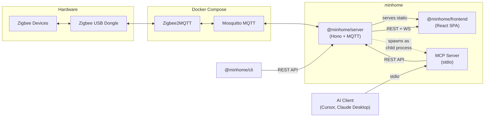

# minhome

A single-room Zigbee smart home controller built on [Zigbee2MQTT](https://www.zigbee2mqtt.io/). Manage lights and smart plugs through a web dashboard with a 3D room view, natural-language AI chat, a CLI, or the [Model Context Protocol](https://modelcontextprotocol.io/) (MCP) for integration with AI coding assistants.

## Architecture



## Entity-First Model

Every controllable endpoint on a device is represented as an **entity**. Zigbee2MQTT's `exposes` structure is the source of truth for entity detection:

- **Single-endpoint devices** (e.g. a light bulb) get one entity with the sentinel key `"main"`.
- **Multi-endpoint devices** (e.g. a 3-socket smart plug) get one entity per endpoint, keyed by Z2M's endpoint name (e.g. `"l1"`, `"l2"`, `"l3"`).

State queries and commands always target an entity, not a device directly. The `control_entity` API accepts **canonical property names** (`state`, `brightness`, `color_temp`) and the server resolves them to the actual MQTT property names (e.g. `state_l3`, `brightness_l3`) automatically.

Entity names are configured in `config.json` using an extensible object format:

```jsonc
"entities": {
  "l1": { "name": "USB Port 1" },
  "l3": { "name": "Sunrise Lamp" }
}
```

The `control_device` endpoint is reserved for device-level properties that don't belong to any entity (e.g. `power_on_behavior`).

## Monorepo Structure

This is a [pnpm workspace](https://pnpm.io/workspaces) monorepo with three packages:

| Package | Path | Description |
|---------|------|-------------|
| `@minhome/server` | [`server/`](server/) | Hono HTTP/WS server, MQTT bridge, automation engine, AI chat, and MCP server |
| `@minhome/frontend` | [`frontend/`](frontend/) | React 19 SPA with 3D room visualization, device controls, automation editor, and AI chat |
| `@minhome/cli` | [`cli/`](cli/) | Commander-based CLI for device and automation management |

Additional directories:

| Path | Purpose |
|------|---------|
| `mosquitto/` | Mosquitto MQTT broker configuration and data (Docker volume) |
| `z2m-data/` | Zigbee2MQTT configuration and database (Docker volume) |

## Prerequisites

- **Node.js** 22+ and **pnpm** 10+
- **Docker** and **Docker Compose** (for MQTT and Zigbee2MQTT)
- A **Zigbee USB coordinator** (e.g. Sonoff Zigbee 3.0 USB Dongle Plus)

## Quick Start

### 1. Install dependencies

```bash
pnpm install
```

### 2. Configure your Zigbee dongle

Edit `docker-compose.yml` and update the `devices` path under the `zigbee2mqtt` service to match your USB dongle's serial path:

```yaml
devices:
  - /dev/serial/by-id/usb-YOUR_DONGLE_ID-port0:/dev/ttyACM0
```

### 3. Set environment variables

Create a `.env` file in the project root (used by Docker Compose):

```env
# Required for AI chat (optional — omit to disable AI features)
AI_API_KEY=sk-...
AI_BASE_URL=https://api.openai.com/v1   # or any OpenAI-compatible endpoint
AI_MODEL=gpt-4o                          # model identifier
```

### 4. Start the stack

**Production** (builds the server image, serves the frontend as static files):

```bash
pnpm up          # docker compose up -d
```

The app will be available at **http://localhost:3111**.

**Development** (hot-reload for both server and frontend):

```bash
pnpm up:dev      # docker compose up -d with dev overlay
```

In dev mode the frontend runs on **http://localhost:5173** (Vite dev server with proxy to the server).

Alternatively, run outside Docker:

```bash
pnpm dev          # starts both server and frontend in parallel
pnpm dev:server   # server only
pnpm dev:frontend # frontend only
```

### 5. Pair Zigbee devices

Open the Zigbee2MQTT dashboard at **http://localhost:8099** and pair your devices. They will appear in the minhome UI automatically.

## Configuration

### `config.json`

Stores device friendly names, entity labels, and the 3D room layout. Edited via the UI/API or by hand.

```jsonc
{
  "devices": {
    "0xa4c138d2b1cf1389": {
      "name": "3x USB Plug",
      "entities": {
        "l1": { "name": "USB Port 1" },
        "l3": { "name": "Sunrise Lamp" }
      }
    }
  },
  "room": {
    "dimensions": { "width": 5.4, "height": 2.5, "depth": 3 },
    "floor": "#cdc0ae",
    "furniture": [
      // Primitives or groups — see server/src/config/room.ts for schema
    ],
    "lights": [
      { "deviceId": "0xc890a81f1ffe0000", "entityId": "main", "position": [2.7, 2.4, 1.5], "type": "ceiling" }
    ]
  }
}
```

### `automations.json`

Stores automation rules. All triggers, conditions, and actions that reference device state use an `entity` field to target a specific entity.

```jsonc
{
  "automations": [
    {
      "id": "morning-lights",
      "name": "Morning Lights",
      "enabled": true,
      "triggers": [{ "type": "time", "at": "08:00" }],
      "conditions": [{ "type": "day_of_week", "days": ["mon","tue","wed","thu","fri"] }],
      "actions": [{
        "type": "device_set",
        "device": "0xc890a81f1ffe0000",
        "entity": "main",
        "payload": { "state": "ON", "brightness": 200 }
      }]
    }
  ]
}
```

## Environment Variables

| Variable | Default | Description |
|----------|---------|-------------|
| `PORT` | `3111` | Server listen port |
| `MQTT_URL` | `mqtt://localhost:1883` | MQTT broker URL |
| `DATA_DIR` | repo root | Directory containing `config.json` and `automations.json` |
| `AI_API_KEY` | _(none)_ | OpenAI-compatible API key (enables AI chat) |
| `AI_BASE_URL` | _(OpenAI default)_ | Custom base URL for AI provider |
| `AI_MODEL` | `gpt-4o` | Model identifier |
| `MINHOME_URL` | `http://localhost:3111` | Server URL (used by CLI and MCP server) |

## Docker Compose Services

| Service | Image | Port | Purpose |
|---------|-------|------|---------|
| `mqtt` | `eclipse-mosquitto:2` | 1883 | MQTT message broker |
| `zigbee2mqtt` | `ghcr.io/koenkk/zigbee2mqtt` | 8099 | Zigbee-to-MQTT bridge |
| `server` | built from `server/Dockerfile` | 3111 | minhome server (+ frontend in production) |
| `frontend` _(dev only)_ | `node:22-slim` | 5173 | Vite dev server with hot-reload |

The dev overlay (`docker-compose.dev.yml`) replaces the built server image with a source-mounted hot-reload setup and adds the frontend dev server.

## MCP Integration

The server includes a standalone MCP server (`server/src/mcp.ts`) that exposes smart home tools over stdio. This lets AI clients like **Cursor** or **Claude Desktop** control your devices and automations.

Add to your MCP client configuration:

```json
{
  "mcpServers": {
    "minhome": {
      "command": "pnpm",
      "args": ["--filter", "@minhome/server", "mcp"],
      "env": {
        "MINHOME_URL": "http://localhost:3111"
      }
    }
  }
}
```

Available MCP tools:

| Tool | Description |
|------|-------------|
| `list_devices` | List all devices with entities and state |
| `get_device` | Get detailed info for a single device |
| `control_entity` | Send a command to a specific entity (state, brightness, etc.) |
| `control_device` | Send a raw command for device-level properties |
| `rename_device` | Set a device's friendly name |
| `rename_entity` | Set a friendly name for one entity on a device |
| `get_room_config` | Read the 3D room configuration |
| `set_room_dimensions` | Update room dimensions and/or floor colour |
| `set_room_lights` | Replace the room's light placements |
| `update_room_furniture` | Replace the entire furniture array |
| `upsert_furniture_item` | Add or update a single named furniture item |
| `remove_furniture_item` | Remove a furniture item by name |
| `list_automations` | List all automations |
| `create_automation` | Create an automation |
| `update_automation` | Update an automation |
| `delete_automation` | Delete an automation |

## Scripts

| Command | Description |
|---------|-------------|
| `pnpm dev` | Start server + frontend in dev mode (outside Docker) |
| `pnpm dev:server` | Start only the server in dev mode |
| `pnpm dev:frontend` | Start only the frontend in dev mode |
| `pnpm build` | Build server + frontend for production |
| `pnpm up` | `docker compose up -d` |
| `pnpm up:dev` | `docker compose up -d` with dev overlay |
| `pnpm down` | `docker compose down` |
| `pnpm logs` | `docker compose logs -f` |
| `pnpm reload` | Restart the server container (dev) |

## License

Private project.
