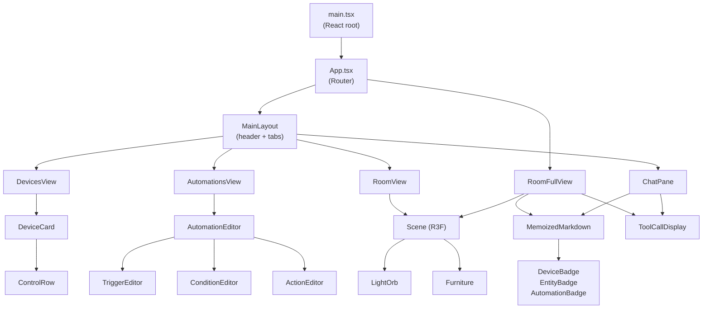

# @minhome/frontend

A React 19 single-page application for controlling your minhome smart room. Built with [Vite](https://vite.dev/), [Tailwind CSS](https://tailwindcss.com/) v4, [React Three Fiber](https://r3f.docs.pmnd.rs/), and the [Vercel AI SDK](https://sdk.vercel.ai/).

## Features

- **Device controls** — toggle switches, brightness sliders, color temperature sliders; inline renaming of devices and entities
- **3D room visualization** — interactive Three.js scene with animated light orbs that reflect real device state; click to toggle
- **Automation editor** — visual editor for triggers, conditions, and actions with nested conditional support
- **AI chat** — natural-language assistant in a resizable side pane (or full-screen overlay on the room view) with streaming responses and rich tool-call display
- **Real-time updates** — WebSocket connection auto-refreshes device state across all views

## Component Architecture



## Key Components

### Views

| Component | File | Description |
|-----------|------|-------------|
| `DevicesView` | `components/DevicesView.tsx` | Grid of device cards with power toggles, brightness/color-temp sliders, entity labels, raw state inspector, and inline rename |
| `AutomationsView` | `components/AutomationsView.tsx` | Accordion list of automations; expand to edit triggers, conditions, and actions in a visual form editor |
| `RoomView` | `components/RoomView.tsx` | Embedded 3D room with orthographic camera, orbit controls, and clickable light orbs. Reads light positions from `config.json` |
| `RoomFullView` | `components/RoomFullView.tsx` | Full-screen 3D room with a floating AI chat overlay — messages appear as translucent text over the scene |
| `ChatPane` | `components/ChatPane.tsx` | Resizable side panel with chat bubbles, streaming indicators, and an auto-growing textarea input |

### Shared Components

| Component | File | Description |
|-----------|------|-------------|
| `MemoizedMarkdown` | `components/MemoizedMarkdown.tsx` | Block-level memoized markdown renderer using `react-markdown` + `rehype-raw`. Maps custom `<device>`, `<entity>`, and `<automation>` HTML tags to badge components |
| `ToolCallDisplay` | `components/ToolCallDisplay.tsx` | Renders AI tool calls as expandable summary rows with icons for each tool (control, inspect, rename, list, create, etc.) |
| `DeviceBadge` / `EntityBadge` / `AutomationBadge` | `components/DeviceBadge.tsx` | Inline pill badges rendered inside markdown; auto-resolve names from live data |

### UI Primitives

Shadcn-style components in `components/ui/`:

| Component | Description |
|-----------|-------------|
| `Button` | Variants: default, secondary, ghost, outline, destructive, success; sizes: default, sm, lg, icon |
| `Card` | Card, CardHeader, CardTitle, CardDescription, CardContent, CardFooter |
| `Badge` | Variants: default, secondary, muted, outline, success |
| `Input` | Styled text input |
| `Slider` | `DebouncedSlider` — range input that tracks local state during drag and commits on release |

## Data Layer

### API Client (`src/api.ts`)

Uses [Hono's RPC client](https://hono.dev/docs/guides/rpc) with the server's `AppType` for end-to-end type safety. Wrapped in [TanStack Query](https://tanstack.com/query) hooks:

| Hook | Description |
|------|-------------|
| `useDevices()` | Fetch all devices (auto-refetch every 10s) |
| `useDevice(id)` | Fetch a single device |
| `useSetDevice()` | Send a command to a device |
| `useRefreshStates()` | Ask the server to re-query all device states from Z2M |
| `useRenameDevice()` | Update a device's friendly name |
| `useRenameEntity()` | Update an entity label on a device |
| `useConfig()` | Fetch the full config (room layout) |
| `useAutomations()` | Fetch all automations |
| `useUpdateAutomation()` | Update an existing automation |
| `useDeleteAutomation()` | Delete an automation |

### Real-time Updates (`useRealtimeUpdates`)

A WebSocket connection to `/ws` that listens for `state_change` and `devices` events and invalidates the TanStack Query cache, triggering re-renders across all views.

### AI Chat

Uses the `useChat()` hook from `@ai-sdk/react`, connected to `POST /api/chat`. Messages are streamed and rendered with tool-call display.

## 3D Room Visualization

The room scene (`RoomView.tsx`) is built with React Three Fiber:

- **Room shell** — floor plane with configurable dimensions (`ROOM_W=5.4m`, `ROOM_D=3m`, `ROOM_H=2.5m`)
- **Furniture** — bed, desk, shelving, drawers, rug — all positioned to match a real room layout
- **Light orbs** — spheres placed at positions defined in `config.json`'s `room.lights` array. Each orb:
  - Reflects its device's on/off state, brightness, and color temperature
  - Smoothly animates between states using `useFrame` lerping
  - Emits a `PointLight` that illuminates the scene
  - Shows a tooltip label on hover
  - Toggles on click
- Color temperature is converted from mireds (142–500) to a warm-to-cool white color

## Design System

### Color Palette

Three custom scales defined in `index.css` via Tailwind `@theme`:

| Scale | Hue | Usage |
|-------|-----|-------|
| `blood` | Red | Cards, backgrounds, secondary UI |
| `sand` | Warm neutral | Text, surfaces, light backgrounds |
| `teal` | Blue-green | Accent, success states, active elements |

### Typography

| Font | Variable | Usage |
|------|----------|-------|
| [Inter Variable](https://rsms.me/inter/) | `--font-sans` | Body text |
| [Space Mono](https://fonts.google.com/specimen/Space+Mono) | `--font-mono` | Labels, badges, code, status text |

## Development

Start the Vite dev server with API proxy:

```bash
pnpm dev
```

This starts on **http://localhost:5173** and proxies `/api` and `/ws` requests to the server (default `http://localhost:3111`, configurable via `VITE_API_TARGET`).

## Scripts

| Command | Description |
|---------|-------------|
| `pnpm dev` | Start Vite dev server with HMR |
| `pnpm build` | Type-check and build to `dist/` |
| `pnpm preview` | Preview the production build locally |

## Dependencies

Key runtime dependencies:

- **[react](https://react.dev/)** 19 + **[react-dom](https://react.dev/)** — UI framework
- **[vite](https://vite.dev/)** 7 + **[@vitejs/plugin-react](https://github.com/vitejs/vite-plugin-react)** — build tool
- **[tailwindcss](https://tailwindcss.com/)** 4 + **[@tailwindcss/vite](https://tailwindcss.com/)** — utility-first CSS
- **[@react-three/fiber](https://r3f.docs.pmnd.rs/)** + **[@react-three/drei](https://drei.docs.pmnd.rs/)** + **[three](https://threejs.org/)** — 3D room visualization
- **[@tanstack/react-query](https://tanstack.com/query)** — data fetching and caching
- **[hono](https://hono.dev/)** — RPC client for type-safe API calls
- **[ai](https://sdk.vercel.ai/)** + **[@ai-sdk/react](https://sdk.vercel.ai/)** — AI chat streaming
- **[react-router-dom](https://reactrouter.com/)** — client-side routing
- **[react-markdown](https://github.com/remarkjs/react-markdown)** + **[rehype-raw](https://github.com/rehypejs/rehype-raw)** — markdown rendering with custom HTML elements
- **[lucide-react](https://lucide.dev/)** — icon library
- **[class-variance-authority](https://cva.style/)** + **[clsx](https://github.com/lukeed/clsx)** + **[tailwind-merge](https://github.com/dcastil/tailwind-merge)** — component variant utilities


