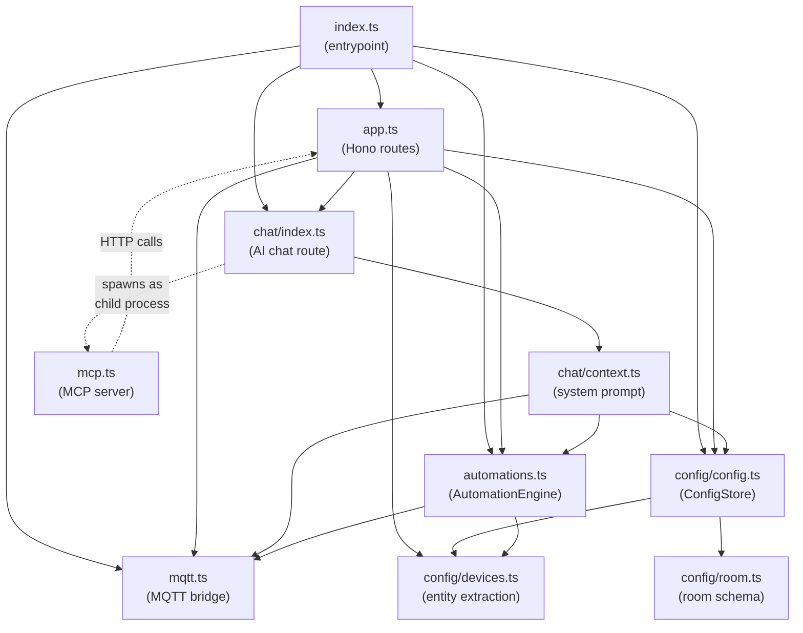

# @minhome/server

The backend for minhome — a [Hono](https://hono.dev/) HTTP/WebSocket server that bridges Zigbee2MQTT, exposes a REST API, runs an automation engine, and provides AI-powered chat.

## Module Architecture

### Entrypoint (`src/index.ts`)

Boots the server:

1. Connects to the MQTT broker via `createMqttBridge()`
2. Loads `config.json` into a `ConfigStore`
3. Loads `automations.json` into an `AutomationEngine`
4. Creates the Hono app with `createApp()` and injects WebSocket support
5. Serves the frontend's `dist/` as static files in production
6. Starts the HTTP server on `PORT` (default 3111)
7. Optionally initializes the MCP client for AI chat (if `AI_API_KEY` is set)
8. Handles graceful `SIGTERM` shutdown

### Entity Extraction (`src/config/devices.ts`)

Implements the entity-first model by extracting entities from Zigbee2MQTT's `exposes` data:

- `extractEntitiesFromExposes()` — scans Z2M's `exposes` array and produces an `ExtractedEntity[]`. Each controllable group (switch or light) becomes one entity with a key (Z2M endpoint name, or `"main"` for single-endpoint devices) and feature map (stateProperty, brightnessProperty, colorTempProperty).
- `buildEntityResponses()` — merges extracted entities with config overrides (friendly names) and live state to produce the API response.
- `resolveEntityPayload()` — translates canonical property names (`state`, `brightness`, `color_temp`) to the actual suffixed MQTT property names (e.g. `state_l3`, `brightness_l3`) for a specific entity.
- `resolveCanonicalProperty()` — resolves a single canonical name to an actual property name.

The entity config schema uses an extensible object format (`{ name: "..." }`) with backward-compatible support for legacy string values.

### MQTT Bridge (`src/mqtt.ts`)

Creates a persistent connection to the MQTT broker and subscribes to Zigbee2MQTT topics:

- `zigbee2mqtt/bridge/devices` — device list; parsed into a `Map<ieee, Z2MDevice>`
- `zigbee2mqtt/bridge/state` — bridge online/offline state
- `zigbee2mqtt/+` — individual device state updates; merged into a `Map<ieee, DeviceState>`

The bridge is an `EventEmitter` that emits:

| Event | Payload | When |
|-------|---------|------|
| `devices` | `Z2MDevice[]` | Device list updated |
| `state_change` | `{ deviceId, friendlyName, state, prev }` | Any device state change |
| `bridge_state` | `string` | Bridge online/offline |
| `mqtt_message` | `{ topic, payload }` | Any non-bridge MQTT message |
| `config_change` | _(none)_ | Room or device config changed via API |

It also provides methods:
- `setDeviceState(deviceId, payload)` — publishes to `zigbee2mqtt/<friendly_name>/set`
- `refreshStates()` — requests current state for all devices via `/get`
- `publish(topic, payload)` — raw MQTT publish
- `destroy()` — disconnects cleanly

### Config Store (`src/config/config.ts`)

Manages `config.json` with a Zod-validated schema. Supports:

- **Device config** — friendly names and entity labels (extensible `{ name: "..." }` objects per entity key)
- **Room layout** — 3D room dimensions, furniture (primitives and groups), and light placements
- **Room mutations** — `patchRoom()` for partial updates, `upsertFurniture()`/`removeFurniture()` for individual furniture items

Reloads from disk on every read so hand-edits are picked up without restart.

### Room Schema (`src/config/room.ts`)

Defines Zod schemas for the 3D room configuration:

- **Furniture primitives** — `box` (cuboid), `cylinder`, `extrude` (polygon extrusion)
- **Furniture groups** — named collections of primitives forming one logical piece
- **Room lights** — positioned light sources linked to device entities by IEEE address + entity key
- **Room dimensions** — bounding box in metres (x = west→east, y = up, z = north→south)
- **Camera** — saved orthographic camera pose

### Automation Engine (`src/automations.ts`)

A rule engine that evaluates triggers, checks conditions, and executes actions. All device state references use the entity-first model — triggers, conditions, and actions include an `entity` field alongside the device IEEE address, and use canonical property names that are resolved to actual MQTT properties at runtime.

**Triggers** (OR logic — any trigger can fire the automation):

| Type | Description |
|------|-------------|
| `device_state` | Fires when a device entity's property changes (optionally filtered by `from`/`to` values) |
| `mqtt` | Fires on a raw MQTT message matching a topic pattern (supports `+` and `#` wildcards) |
| `cron` | Fires on a cron schedule (e.g. `0 8 * * *`) |
| `time` | Fires once per day at a specific `HH:MM` time |
| `interval` | Fires every N seconds |

**Conditions** (AND logic — all must pass):

| Type | Description |
|------|-------------|
| `time_range` | Current time is within `after`–`before` window (supports midnight wrap-around) |
| `day_of_week` | Current day is in the allowed list |
| `device_state` | A device entity's property equals a specific value |

**Actions** (executed sequentially):

| Type | Description |
|------|-------------|
| `device_set` | Send a command to a device entity (resolves canonical property names) |
| `mqtt_publish` | Publish a raw MQTT message |
| `delay` | Pause for N seconds |
| `conditional` | Branch on a runtime condition (supports nested `then`/`else` action lists) |

Automations are persisted to `automations.json` and reloaded on create/update/delete. Cron jobs and intervals are managed via [croner](https://github.com/hexagon/croner).

### AI Chat (`src/chat/`)

Provides an LLM-powered assistant that can inspect and control the smart home.

- **`chat/index.ts`** — manages an MCP client singleton that spawns `mcp.ts` as a child process over stdio. Exposes the `POST /api/chat` route that streams responses using the [Vercel AI SDK](https://sdk.vercel.ai/) with `streamText()`.
- **`chat/context.ts`** — `buildSystemPrompt()` injects live device/entity state and automation summaries into the system prompt, along with guidelines for entity-first control and inline `<device>`, `<entity>`, and `<automation>` tags that the frontend renders as interactive badges.

The AI model is configured via `AI_API_KEY`, `AI_BASE_URL`, and `AI_MODEL` environment variables. Any OpenAI-compatible provider works.

### MCP Server (`src/mcp.ts`)

A standalone [Model Context Protocol](https://modelcontextprotocol.io/) server that communicates over stdio. It uses the Hono RPC client to call the server's REST API.

It serves two purposes:
1. **Internal** — spawned by `chat/index.ts` to give the AI chat tool-calling capabilities
2. **External** — run directly (`pnpm --filter @minhome/server mcp`) for integration with AI clients like Cursor or Claude Desktop

Exposed tools:

| Tool | Description |
|------|-------------|
| `list_devices` | List all devices with entities and state |
| `get_device` | Get detailed info for a single device |
| `control_entity` | Send a command to a specific entity (canonical property names) |
| `control_device` | Send a raw command for device-level properties |
| `rename_device` | Set a device's friendly name |
| `rename_entity` | Set a friendly name for one entity on a device |
| `get_room_config` | Read the 3D room configuration |
| `set_room_dimensions` | Update room dimensions and/or floor colour |
| `set_room_lights` | Replace the room's light placements |
| `update_room_furniture` | Replace the entire furniture array |
| `upsert_furniture_item` | Add or update a single named furniture item |
| `remove_furniture_item` | Remove a furniture item by name |
| `list_automations` | List all automations |
| `create_automation` | Create an automation |
| `update_automation` | Update an automation |
| `delete_automation` | Delete an automation |

## API Reference

### Devices

| Method | Path | Description |
|--------|------|-------------|
| `GET` | `/api/devices` | List all non-coordinator devices with entities, state, and exposes |
| `GET` | `/api/devices/:id` | Get a single device by IEEE address |
| `POST` | `/api/devices/refresh` | Ask Z2M to re-query all device states |
| `POST` | `/api/devices/:id/set` | Send a raw command payload to a device (device-level properties) |
| `POST` | `/api/devices/:id/entities/:entityKey/set` | Send a command to a specific entity (canonical property names resolved automatically) |
| `PUT` | `/api/devices/:id/config` | Update device config — name and/or entity labels |

### Config

| Method | Path | Description |
|--------|------|-------------|
| `GET` | `/api/config` | Get the full config (devices + room layout) |
| `GET` | `/api/config/room` | Get the room configuration |
| `PUT` | `/api/config/room` | Replace the entire room configuration |
| `PATCH` | `/api/config/room` | Partially update the room (dimensions, floor, furniture, lights) |
| `PUT` | `/api/config/room/camera` | Save camera position |
| `PUT` | `/api/config/room/furniture/:name` | Upsert a single furniture item by name |
| `DELETE` | `/api/config/room/furniture/:name` | Remove a furniture item by name |

### Automations

| Method | Path | Description |
|--------|------|-------------|
| `GET` | `/api/automations` | List all automations |
| `GET` | `/api/automations/:id` | Get a single automation |
| `POST` | `/api/automations` | Create a new automation (body: full automation object with entity fields) |
| `PUT` | `/api/automations/:id` | Update an automation (body: partial automation object) |
| `DELETE` | `/api/automations/:id` | Delete an automation |

### AI Chat

| Method | Path | Description |
|--------|------|-------------|
| `GET` | `/api/chat/info` | Get model name and availability status |
| `GET` | `/api/chat/debug` | Dump system prompt and MCP tool definitions for debugging |
| `POST` | `/api/chat` | Send a chat message; returns a streaming UI message response (body: `{ "messages": UIMessage[] }`) |

### WebSocket

| Path | Description |
|------|-------------|
| `GET /ws` | Upgrade to WebSocket. Receives JSON messages: `{ type: "state_change", data }`, `{ type: "devices", data }`, `{ type: "automation_fired", id, trigger }`, `{ type: "config_change" }` |

## Scripts

| Command | Description |
|---------|-------------|
| `pnpm dev` | Start with hot-reload via `tsx watch` |
| `pnpm build` | Compile TypeScript to `dist/` |
| `pnpm start` | Run the compiled `dist/index.js` |
| `pnpm mcp` | Start the MCP server on stdio |

## Dependencies

Key runtime dependencies:

- **[hono](https://hono.dev/)** — lightweight web framework (HTTP + WebSocket)
- **[mqtt](https://github.com/mqttjs/MQTT.js)** — MQTT client for Zigbee2MQTT communication
- **[ai](https://sdk.vercel.ai/)** / **[@ai-sdk/openai](https://sdk.vercel.ai/)** — Vercel AI SDK for LLM streaming
- **[@ai-sdk/mcp](https://sdk.vercel.ai/)** / **[@modelcontextprotocol/sdk](https://modelcontextprotocol.io/)** — MCP client and server
- **[croner](https://github.com/hexagon/croner)** — cron scheduling for automations
- **[zod](https://zod.dev/)** — schema validation for API inputs and config files
